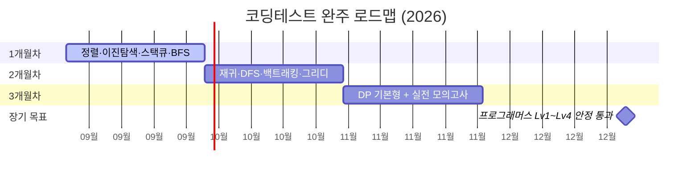

<h1 align="center">Hi, I'm Yuchan Kim 👋</h1>
<p align="center">뒤쳐지지 않는 자바 백엔드 개발자가 되기 위해 매일 기록하는 중</p>

<p align="center">
  <a href="https://yuchankim-dev.github.io/"></a>
</p>

---

## 🧑‍💻 About Me

- 🎓 Boston University — Computer Science (B.A.)
- 📜 SQLD · 네트워크관리사 2급 · 리눅스마스터 2급
- 💼 백엔드 개발자로 재직 중 (<!--DAYS_START-->510<!--DAYS_END-->일째, 2025-04-24 입사)
- 📚 요즘 하는 일: 3개월 코딩테스트 완주 + 연말까지 프로그래머스 Lv1~Lv4 안정적 통과 준비 중
- ✍️ 매일 푼 문제와 시행착오를 [블로그](https://yuchankim-dev.github.io/)에 기록합니다

## 🛠️ Tech Stack

<p>
  
  
  
  
  
  
  
</p>

## 📈 코딩테스트 준비 현황

**출제 비중 80%를 차지하는 5개 유형** 기준 진행률 (2026-09-16 기준):

```text
이진 탐색   ██████░░░░  60%   (기본형 완료, 파라메트릭 서치 진행 중)
BFS         ░░░░░░░░░░   0%
DFS         ░░░░░░░░░░   0%
DP          ░░░░░░░░░░   0%
구현        ░░░░░░░░░░   0%
```

**3개월 로드맵 vs 목표 타임라인**



- **지금 위치**: 1개월차, 이진 탐색 → 파라메트릭 서치
- **12월 목표**: 프로그래머스 Lv1~Lv4를 제한 시간 안에 안정적으로 통과

## 🔥 GitHub Stats

<p>
  
  
</p>

---

<p align="center"><sub>이 프로필은 매일 자동으로 근속 일수가 갱신됩니다.</sub></p>
