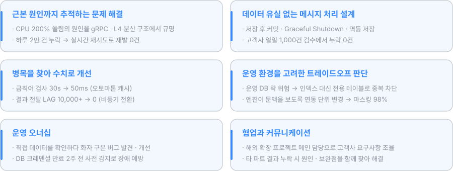
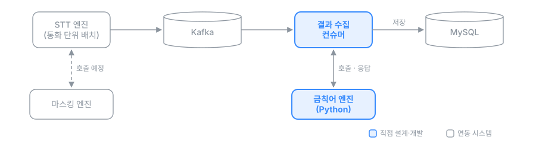
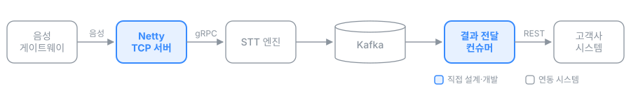
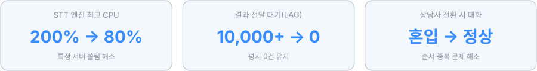
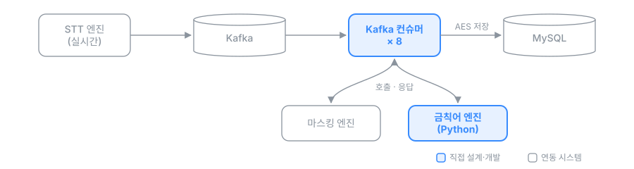
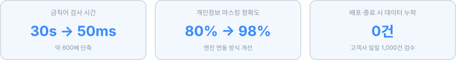
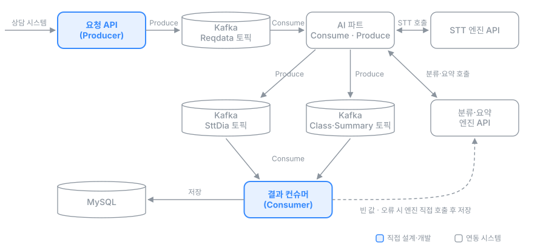
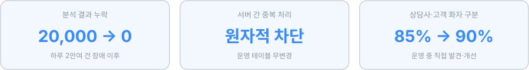

# 김유찬 · Yuchan Kim

 

 

## 👤 About

<table width="100%">
<tr>
<td width="130"><b>학력</b></td>
<td width="900">&nbsp; Boston University — Computer Science (B.A.)</td>
</tr>
<tr>
<td><b>경력</b></td>
<td>백엔드 개발자 · 2025-04-24 ~ 현재 (<!--YM_START-->1년 5개월차<!--YM_END--> · <!--DAYS_START-->531<!--DAYS_END-->일째)</td>
</tr>
<tr>
<td><b>주요 경험</b></td>
<td>Kafka 기반 실시간 데이터 파이프라인 · 음성인식(STT) 연동 백엔드 · TCP 소켓 서버</td>
</tr>
<tr>
<td><b>자격증</b></td>
<td>SQLD · 네트워크관리사 2급 · 리눅스마스터 2급</td>
</tr>
<tr>
<td><b>관심 분야</b></td>
<td>대용량 트래픽을 견디는 백엔드 설계, 이벤트 스트리밍</td>
</tr>
<tr>
<td><b>기록</b></td>
<td><a href="https://yuchankim-dev.github.io/">Don't Stop Keep Going</a> — 배운 것을 글로 남기며 매일 쌓아가는 중</td>
</tr>
</table>

## 🎯 Core Strengths

 

## 🛠 Tech Stack

<table width="100%">
<tr>
<td width="130"><b>Language</b></td>
<td width="900">
 
</td>
</tr>
<tr>
<td><b>Framework</b></td>
<td>
 
</td>
</tr>
<tr>
<td><b>Network</b></td>
<td>

</td>
</tr>
<tr>
<td><b>Database</b></td>
<td>
  
</td>
</tr>
<tr>
<td><b>Messaging</b></td>
<td>

</td>
</tr>
<tr>
<td><b>Container</b></td>
<td>

</td>
</tr>
<tr>
<td><b>OS</b></td>
<td>
 
</td>
</tr>
<tr>
<td><b>Version&nbsp;Control</b></td>
<td>
  
</td>
</tr>
<tr>
<td><b>Build</b></td>
<td>

</td>
</tr>
<tr>
<td><b>CI/CD</b></td>
<td>

</td>
</tr>
<tr>
<td><b>IDE</b></td>
<td>

</td>
</tr>
<tr>
<td><b>Issue&nbsp;Tracking</b></td>
<td>
   
</td>
</tr>
<tr>
<td><b>Communication</b></td>
<td>

</td>
</tr>
<tr>
<td><b>AI</b></td>
<td>

</td>
</tr>
</table>

 

## 💼 Projects

> 모든 프로젝트에서 **전체 설계에 참여**하고, 백엔드 담당 파트의 **애플리케이션 설계·개발부터 운영·유지보수까지** 맡고 있습니다.

### Project 1 · 해외 콜센터 STT 서비스 확장 &nbsp;|&nbsp; 메인 담당 · 백엔드 설계·개발·운영

`2026.09 ~ 진행 중` &nbsp; 콜센터 STT 솔루션 해외 법인 확장

- 통화 단위 배치 이벤트 구조에 맞춰 Kafka 컨슈머 재설계·개발, 테스트 환경 실데이터 검증 완료
- 메인 담당으로 고객사 요구사항 조율 및 운영 전환 준비 중

 

### Project 2 · 실시간 상담 음성 스트리밍 STT 연동 시스템 &nbsp;|&nbsp; 백엔드 설계·개발·운영

`2026.02 ~ 2026.06` &nbsp; 최대 480채널 동시 처리 · AWS

1. **엔진 부하 쏠림** — gRPC는 연결 하나를 오래 재사용하고 L4 로드밸런서는 연결 단위로만 분산해, 한 서버에 통화가 몰림 → 채널 풀 + 주기적 연결 회전(진행 중 통화 유지)으로 재분산 &nbsp;`gRPC` `Netty`
2. **결과 전달 지연** — 동기 호출의 처리량 한계, 끊긴 연결 재사용 오류, 새벽 유휴 연결 끊김이 겹침 → WebClient 비동기 전환, 동시 요청 제한, 연결 오류만 백오프 재시도, keepalive 설정 &nbsp;`WebClient` `at-least-once`
3. **상담사 전환 시 대화 섞임** — 전환 시 재연결로 문장 번호가 어긋나 순서 뒤섞임·이전 상담사 대화 혼입·중복 거절 발생 → 통화·상담사·채널 단위로 번호 재발번, 같은 통화는 한 워커가 순서대로 처리 &nbsp;`Message Ordering`

 

### Project 3 · 실시간 상담 STT 수집 플랫폼 &nbsp;|&nbsp; 백엔드 설계·개발·운영

`2025.12 ~ 2026.02` &nbsp; 8개 인스턴스 × 64 파티션 · 금칙어 엔진 직접 개발

1. **금칙어 검사 지연으로 LAG 누적** — 직접 개발한 금칙어 엔진(Python)이 호출마다 키워드 100만 건으로 Aho-Corasick 오토마톤을 새로 생성해 건당 30초 소요 → 오토마톤을 메모리에 캐시해 재사용, **50ms**로 단축하고 LAG 해소 &nbsp;`Python` `Aho-Corasick` `Cache`
2. **마스킹 정확도 80%** — 문맥으로 판단하는 NLU 엔진에 문장을 하나씩 보내 여러 문장에 걸친 개인정보를 놓침 → 통화 종료 시 통화 단위로 일괄 요청 후 문장별 재분할·일괄 업데이트 &nbsp;`Batch Update`
3. **24시간 서비스의 배포·종료 시 유실 위험** — 리스너 단계적 정지 → 내부 큐·처리 중 작업 소진 → 종료하는 Graceful Shutdown 설계, DB 저장 성공 후에만 오프셋 커밋 &nbsp;`Graceful Shutdown` `Manual Ack`

 

### Project 4 · 상담 AI 분석 파이프라인 (STT · 유형분류 · 요약) &nbsp;|&nbsp; 백엔드 설계·개발·운영

`2025.08 ~ 2025.12` &nbsp; 서버 2대 운영

1. **하루 2만여 건 결과 누락 장애** — 다른 파트에서 전달할 분류·요약 결과가 주기적으로 누락 → 복구 앱으로 누락분을 채우고, 빈 값·오류 수신 시 엔진을 직접 재호출하는 실시간 재시도로 재발 차단 &nbsp;`Retry` `ThreadPool`
2. **서버 2대 환경의 중복 처리** — 상담사 수동 재요청과 서버 간 메모리 미공유로 같은 통화가 중복 처리됨 → 락 위험이 있는 운영 테이블 인덱스 대신 전용 테이블 + `INSERT IGNORE`로 원자 판정, TTL 인계, fail-open &nbsp;`Idempotency`
3. **모든 대화가 상담사로 저장되는 버그** — 엔진의 화자 표기 형식 불일치와 동수 판정 결함 → 표기 정규화, 발화 수 비교 제거, 상담사 확정 멘트 보정 &nbsp;`Data Quality`
